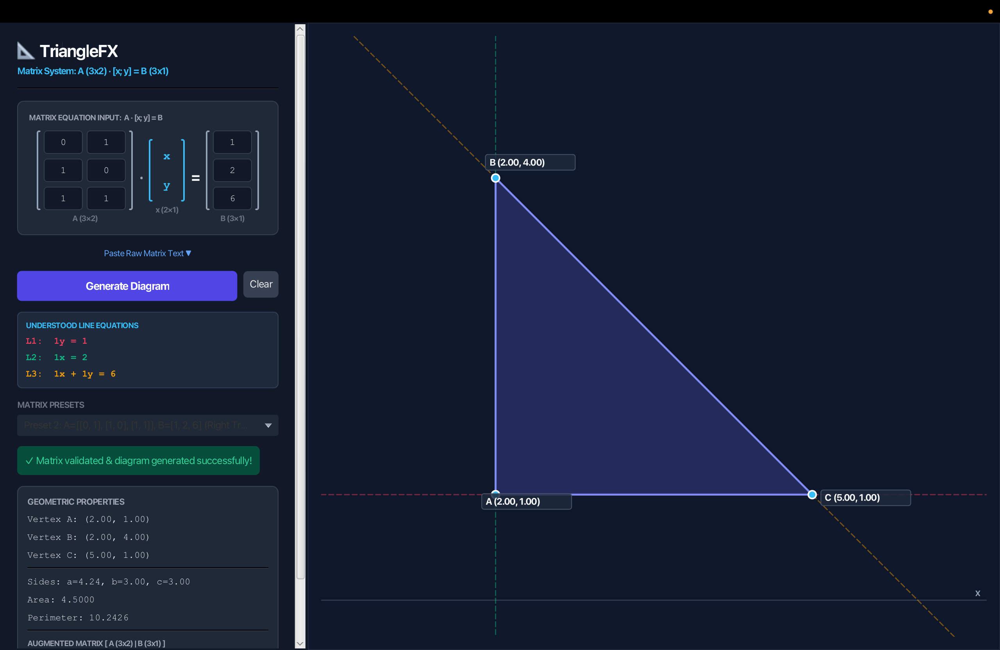
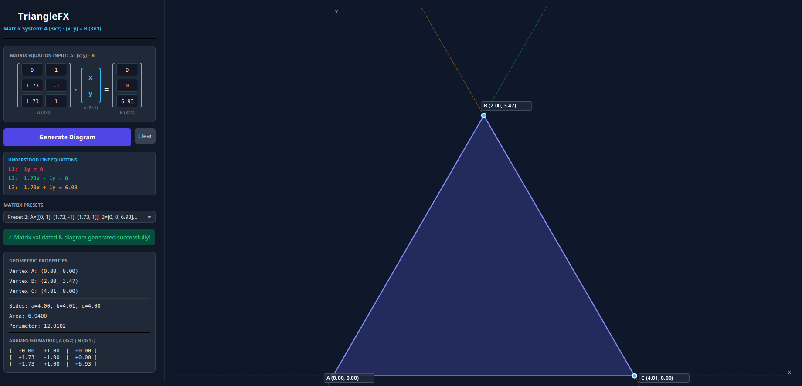

# 📐 TriangleFX

**TriangleFX** is a JavaFX desktop app that takes three linear equations, finds where they intersect, and draws the resulting triangle with its measurements.

---

<p align="center">
  
</p>

<p align="center">
  
</p>

---

## 📑 Table of Contents

- [Setup and Run](#-setup-and-run)
- [What Does It Do?](#-what-does-it-do)
- [How the Math Works](#-how-the-math-works)
- [Features](#-features)
- [How the Code is Organized](#-how-the-code-is-organized)
- [Entering Numbers](#-entering-numbers)
- [Step-by-Step Flow](#-step-by-step-flow)
- [Project Folders](#-project-folders)

---

## 🚀 Setup and Run

### What You Need

- **Java JDK** — version 21 or higher
- **Apache Maven** — version 3.8 or higher

Check if they're installed:

```bash
java -version
mvn -version
```

### Launch the App

Opens the interactive window:

```bash
mvn clean javafx:run
```

### Run the Tests

Checks that all math calculations work correctly:

```bash
mvn test
```

### Build a Runnable File

Packages everything into a `.jar` file in the `target/` folder:

```bash
mvn clean package
```

---

## 💡 What Does It Do?

Think of **three straight lines** drawn on graph paper. If they cross each other at three different points, they form a triangle. But sometimes the lines don't cooperate:

- Two lines might run in the **same direction** and never cross (like train tracks).
- All three lines might cross at the **exact same point**, trapping no space inside.

**TriangleFX** handles all of this for you:

1. You enter **9 numbers** (3 rows × 3 values) that describe three lines.
2. The app finds the **3 corners** where the lines cross.
3. It checks that the lines truly form a **real, open triangle**.
4. It draws the triangle and shows you its **side lengths, perimeter, and area**.

---

## 🧮 How the Math Works

### Lines as Numbers

Each line is described by three numbers: two "tilt" values and one "target":

```text
a·x + b·y = c
```

You give three of these lines, so you fill in a 3-row grid (called a **matrix**):

```text
┌                 ┐   ┌   ┐     ┌    ┐
│  a11       a12  │   │ x │     │ b1 │
│  a21       a22  │ · │   │  =  │ b2 │
│  a31       a32  │   │ y │     │ b3 │
└                 ┘   └   ┘     └    ┘
   Matrix A (3×2)     Vector x   Vector B (3×1)
```

- **Left grid (A)** — 6 numbers, two per line, controlling its tilt.
- **Right column (B)** — 3 numbers, one per line, shifting it into position.

### Finding the Corners

Each corner is where two lines meet. To find the crossing point, the app computes a test value called the **determinant**:

```text
D = (a1·b2) - (a2·b1)
```

- If **D = 0** → the lines are parallel and never cross. No corner possible.
- If **D ≠ 0** → the lines cross at one point, found using simple division.

The three corners are:

- **C** — where Line 1 meets Line 2
- **A** — where Line 2 meets Line 3
- **B** — where Line 3 meets Line 1

### Checking It's a Real Triangle

Three rules must pass before the app draws anything:

1. **All pairs must cross** — no two lines can be parallel.
2. **Three distinct corners** — all three crossing points must be different spots.
3. **Non-zero area** — the three corners can't all sit on the same straight line. Area is checked using the **Shoelace Formula**:

```text
2 · Area = | x1·(y2 - y3) + x2·(y3 - y1) + x3·(y1 - y2) |
```

If the area is greater than 0, the triangle is drawn. Otherwise, a clear message explains what went wrong.

---

## ✨ Features

- **Type numbers directly** into the 9 input boxes.
- **Choose a preset** triangle to get started quickly:
  - *Standard* — a simple everyday triangle.
  - *Right* — has a perfect 90° corner.
  - *Equilateral-like* — all sides roughly equal.
  - *Oblique* — no right angles; tilted and irregular.
- **Live equation display** — shows your numbers as readable equations (e.g. `L1: x + y = 8`).
- **Measurements panel** — corner coordinates, side lengths, perimeter, and area.
- **Smart graph canvas** — auto-zooms to fit, draws axes and grid, marks corners with labels.
- **Dark theme** — easy on the eyes with a modern slate and blue color scheme.

---

## 🏛️ How the Code is Organized

| Package      | Files                                                    | Role                                               |
| :----------- | :------------------------------------------------------- | :------------------------------------------------- |
| `model`    | `Point`, `Line`, `Triangle`                        | Basic building blocks — dots, lines, triangles.   |
| `geometry` | `GeometryService`, `GeometryException`               | Does the math — finds crossings, checks validity. |
| `parser`   | `EquationParser`, `MatrixParser`, `ParseException` | Reads typed text and pulls out the numbers.        |
| `ui`       | `TriangleApp`, `TriangleCanvas`                      | Builds the window and draws the graph.             |
| root         | `Main`                                                 | Starts the app.                                    |

---

## 📥 Entering Numbers

### Using the Input Grid

Fill in 3 rows of boxes:

|       Row       | x-tilt | y-tilt | Target | Line it represents   |
| :-------------: | :-----: | :-----: | :----: | :------------------- |
| **Row 1** | `a11` | `a12` | `b1` | a11·x + a12·y = b1 |
| **Row 2** | `a21` | `a22` | `b2` | a21·x + a22·y = b2 |
| **Row 3** | `a31` | `a32` | `b3` | a31·x + a32·y = b3 |


## 🔄 Step-by-Step Flow

Here is what happens when you click **"Generate Diagram"**:

```text
  ┌────────────────────────────────────────────────────────┐
  │               1. Enter 9 Numbers                       │
  │      (type or pick a preset)                           │
  └───────────────────────────┬────────────────────────────┘
                              │
                              ▼
  ┌────────────────────────────────────────────────────────┐
  │               2. Read the Numbers                      │
  │         Turns them into 3 Line objects                 │
  └───────────────────────────┬────────────────────────────┘
                              │
                              ▼
  ┌────────────────────────────────────────────────────────┐
  │                  3. Do the Math                        │
  │   • Find the 3 crossing points (corners)               │
  │   • Are any lines parallel?                            │
  │   • Do all three lines meet at one dot?                │
  │   • Is the area greater than zero?                     │
  └───────────────────────────┬────────────────────────────┘
                              │
                 ┌────────────┴────────────┐
                 │                         │
           Real Triangle!            Something's Wrong
                 │                         │
                 ▼                         ▼
  ┌──────────────────────────┐  ┌──────────────────────────┐
  │   4. Draw the Triangle   │  │   4. Show Error Message  │
  │  • Auto-zooms to fit     │  │  • Plain-English reason  │
  │  • Draws grid & axes     │  │    for what went wrong   │
  │  • Shows measurements    │  └──────────────────────────┘
  └──────────────────────────┘
```

---

## 📁 Project Folders

```text
CSC360-Group1/
├── docs/
│   └── presentation/               # Slide deck files
├── pom.xml                         # Build configuration
├── README.md                       # This file
└── src/
    ├── main/
    │   └── java/com/trianglefx/
    │       ├── Main.java                  # Starts the app
    │       ├── geometry/
    │       │   ├── GeometryException.java # Error messages for bad geometry
    │       │   └── GeometryService.java   # Finds crossings, checks validity
    │       ├── model/
    │       │   ├── Line.java              # A straight line (ax + by = c)
    │       │   ├── Point.java             # A point on the graph (x, y)
    │       │   └── Triangle.java          # A triangle with its measurements
    │       ├── parser/
    │       │   ├── EquationParser.java    # Reads equation text
    │       │   ├── MatrixParser.java      # Reads number grids from text
    │       │   └── ParseException.java    # Error messages for bad input
    │       ├── resources/                 # Screenshots and images
    │       └── ui/
    │           ├── TriangleApp.java       # Window layout and controls
    │           └── TriangleCanvas.java    # Draws the graph and triangle
    └── test/
        └── java/com/trianglefx/
            ├── geometry/
            │   └── GeometryServiceTest.java    # Tests for math calculations
            └── parser/
                ├── EquationParserTest.java     # Tests for reading equations
                └── MatrixParserTest.java       # Tests for reading numbers
```
